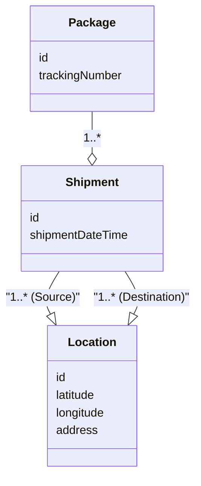
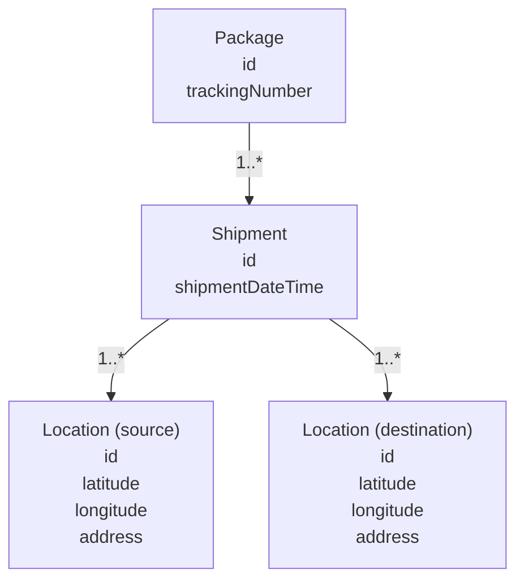

# GLS 2

## Domain model

### Mermaid class diagram - almost a domain model

```mermaid
classDiagram
  Package --o Shipment : 1..*
  Shipment --|> Location : "1..* (Source)"
  Shipment --|> Location : "1..* (Destination)"

  class Package {
    id
    trackingNumber
  }

  class Shipment {
    id
    shipmentDateTime
  }

  class Location {
    id
    latitude
    longitude
    address
  }
```
## Mermaid graph (not completely a domain model)

```mermaid
graph TD
  Package["Package\nid\ntrackingNumber"] -->|1..*| Shipment["Shipment\nid\nshipmentDateTime"]
  Shipment -->|1..* | Location_source["Location (source)\nid\nlatitude\nlongitude\naddress"]
  Shipment -->|1..* | Location_destination["Location (destination)\nid\nlatitude\nlongitude\naddress"]
```