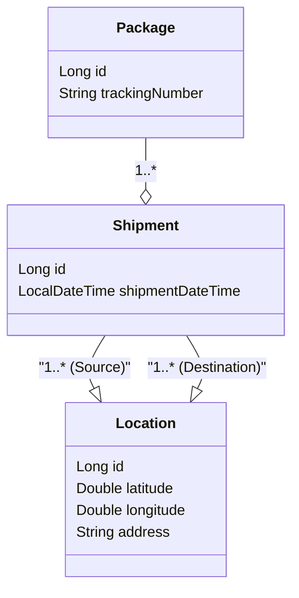

# GLS 2

## Domain model

```mermaid
classDiagram
  Package --o Shipment : 1..*
  Shipment --|> Location : "1..* (Source)"
  Shipment --|> Location : "1..* (Destination)"

  class Package {
    Long id
    String trackingNumber
  }

  class Shipment {
    Long id
    LocalDateTime shipmentDateTime
  }

  class Location {
    Long id
    Double latitude
    Double longitude
    String address
  }
```