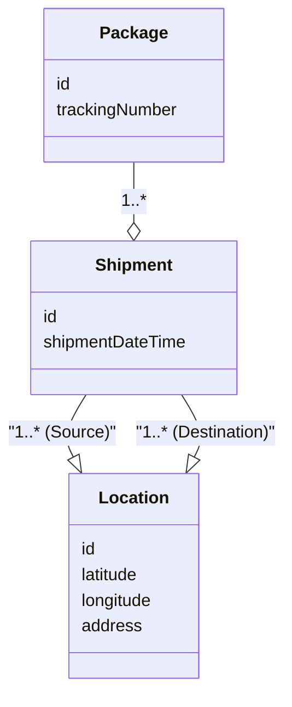

# GLS 2

## Domain model

```mermaid
classDiagram
  Package --o Shipment : 1..*
  Shipment --|> Location : "1..* (Source)"
  Shipment --|> Location : "1..* (Destination)"

  class Package {
    id
    trackingNumber
  }

  class Shipment {
    id
    shipmentDateTime
  }

  class Location {
    id
    latitude
    longitude
    address
  }
```