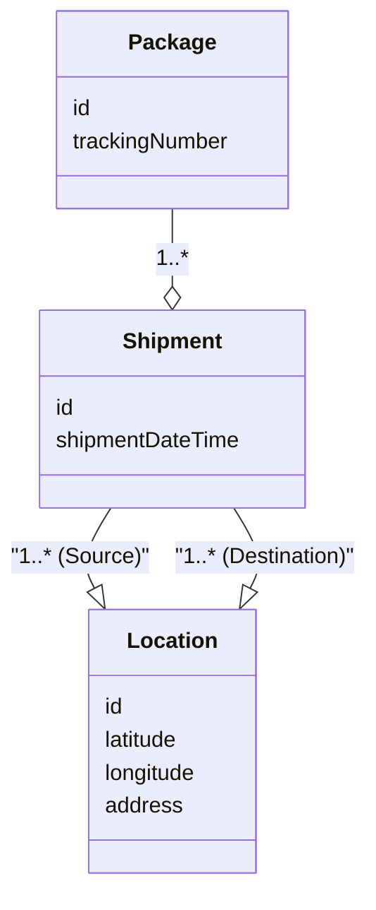
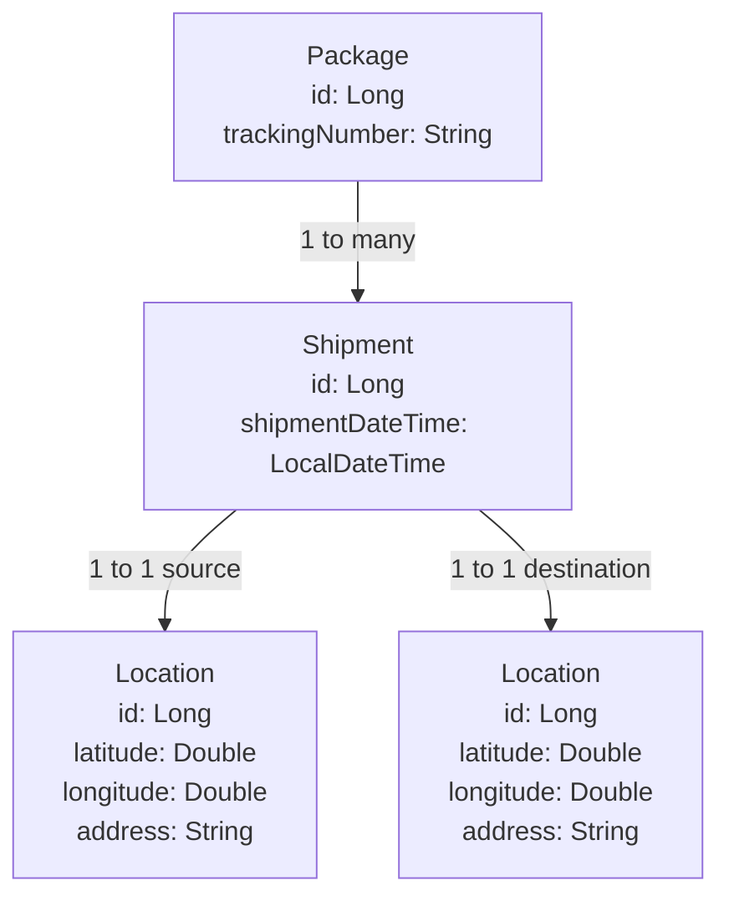

# GLS 2

## Domain model

```mermaid
classDiagram
  Package --o Shipment : 1..*
  Shipment --|> Location : "1..* (Source)"
  Shipment --|> Location : "1..* (Destination)"

  class Package {
    id
    trackingNumber
  }

  class Shipment {
    id
    shipmentDateTime
  }

  class Location {
    id
    latitude
    longitude
    address
  }
```

```mermaid
graph TD
  Package["Package\nid: Long\ntrackingNumber: String"] -->|1 to many| Shipment["Shipment\nid: Long\nshipmentDateTime: LocalDateTime"]
  Shipment -->|1 to 1 source| Location1["Location\nid: Long\nlatitude: Double\nlongitude: Double\naddress: String"]
  Shipment -->|1 to 1 destination| Location2["Location\nid: Long\nlatitude: Double\nlongitude: Double\naddress: String"]
```