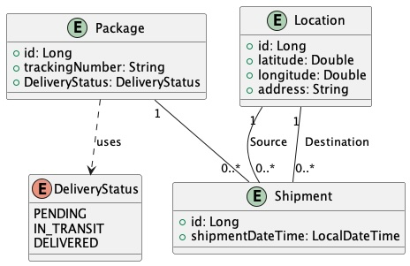
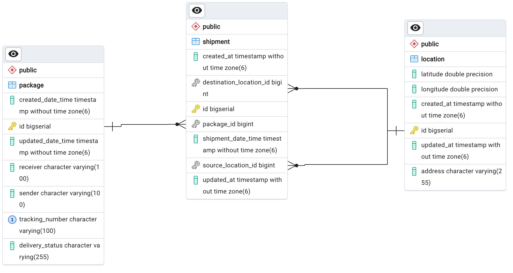

# GLS 2

## Class diagram

## ERD  diagram

## Recommendation from chatGPT regarding Persisting and Updating the `Package`, `Shipment`, and `Location` Entities

1. **Manual Persistence without Cascading:**
    - Avoid using cascading for `Shipment` and `Location` to have better control over the persistence and updates of these entities. Handle the persistence of related entities explicitly.

2. **Transactional Control:**
    - Wrap the `createPackage` and `updatePackage` operations in a single transaction to ensure that the entire process succeeds or fails as a unit.

3. **Check Entity Existence:**
    - Before persisting a `Shipment` or `Location`, check if the entity already exists in the database (i.e., if it has a non-null `id`).
    - If the entity is new (i.e., `id` is `null`), persist it. Otherwise, merge it to update the existing entity.

4. **Persist in the Correct Order:**
    - Persist or update the `Package` first, then iterate through the `Shipment` entities and handle their persistence individually.
    - For each `Shipment`, ensure that the related `Location` entities (source and destination) are persisted or updated before persisting the `Shipment` itself.

5. **Handle Bi-Directional Relationships Properly:**
    - Make use of helper methods (like `addShipment`, `addSourceLocation`, and `addDestinationLocation`) to maintain the bi-directional relationship between `Package`, `Shipment`, and `Location`.
    - Always ensure both sides of the relationship are properly set (e.g., setting the `relatedPackage` in `Shipment`).

6. **Use `merge` for Updates:**
    - When updating, use `merge` instead of `persist` to handle detached entities (entities that were previously persisted but are outside the current persistence context). This ensures that existing entities are re-attached and updated.

7. **Automatic Timestamp Management:**
    - Leverage `@PrePersist` and `@PreUpdate` hooks in the entities to automatically set `createdAt` and `updatedAt` fields, ensuring that timestamps are always up-to-date.

### Example Workflow:

- **For creating a package**:
    1. Persist the `Package`.
    2. For each `Shipment`, persist or update its related `Location` entities (`sourceLocation` and `destinationLocation`).
    3. Persist each `Shipment` after the related `Location` entities have been handled.

- **For updating a package**:
    1. Merge the `Package` to update its details.
    2. For each `Shipment`, merge or persist its related `Location` entities.
    3. Merge each `Shipment` to update its details and maintain relationships.

This approach ensures explicit control over the persistence process, avoids common issues like `TransientPropertyValueException`, and maintains data consistency across the `Package`, `Shipment`, and `Location` entities.