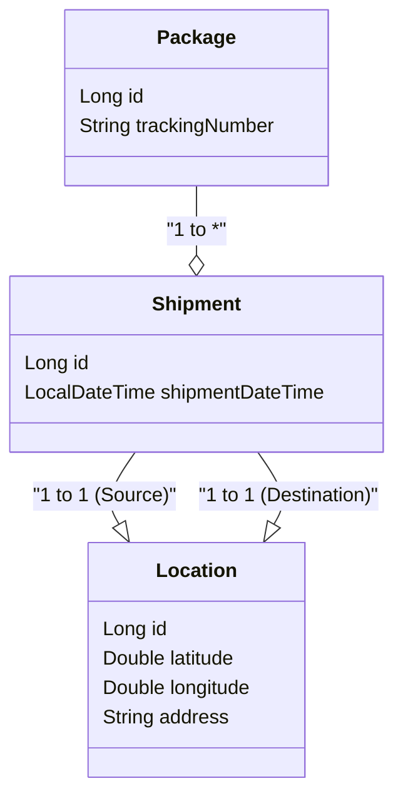

# GLS 2

## Domain model

```plaintext
+----------------+      1   *      +----------------+
|    Package     |<----------------|    Shipment    |
+----------------+                 +----------------+
| ID             |                 | ID             |
| TrackingNumber |                 | ShipmentDate   |
+----------------+                 +----------------+
                                           | 1   | 1
                                           | *   | *
                            +----------------+ +----------------+
                            |   Location     | |   Location     |
                            +----------------+ +----------------+
                            | ID             | | ID             |
                            | Latitude       | | Latitude       |
                            | Longitude      | | Longitude      |
                            | Address        | | Address        |
                            +----------------+ +----------------+
```

